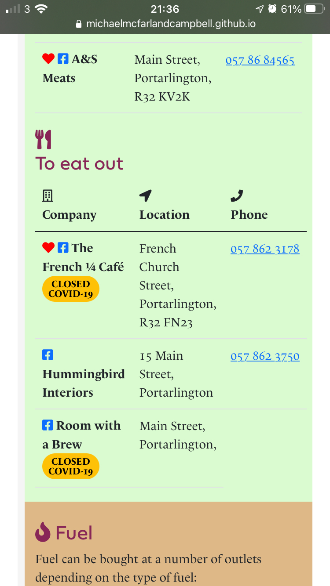

# Portarlington Information 2021 (PortInfo-2021)

[View the live project here.](https://michaelmcfarlandcampbell.github.io/portcominfo/information.html)

## UX 

## Goals
### External user's goal:

The site users are residents and potential residents of Portarlington in County Laois, Ireland who want to learn more about the history and amenities of the town. 

### Site owner's goals:
The site owner wants to help the local community by highlighting events that are happening in the local area and also to sell merchandise that the site owner has produced. 

### Potential features: 
* Showcase photos both historical and modern of the town
* Showcase local shops
* Shop to purchase merchandise 

## Features 

## Pages
### Home
Information about the page and the Portarlington Community Information Project.

### Local information
This page will have a list of local facilities about:
* Banking
* Church
* Food
* Fuel
* Leisure
* Pharmacy

Above the navigation for these categories will be a box with a button looking for intereaction with the user.  

Some categories will have a recommended entry marked with a red heart using an icon from Fontawesome. 

### Support us
This page will have opportunities to support the local community organisation by highlighting merchandise available from local shops or online.

## Design

### Imagery 

### Colour Scheme
The main colour is 
*  `#872658` which is an approximation for the colour of the Portarlington GAA and Rugby clubs colours. This colour is used for the footer background, and for most headings.

I used Adobe Colour to find complementary colours which are used to highlight each of the sections in the Information page. 

### Typography
The two typefaces used complement each other and clearly distinguish between items. 

#### Headings
Use the [Fieldwork](https://fonts.adobe.com/fonts/fieldwork) font. 

#### Body text and menus 
The [Le Monde Livre Classic](https://fonts.adobe.com/fonts/le-monde-livre-classic) typeface is used for body text and menus. When choosing the font, particular care was taken to ensure that ≪Old Style≫ numbers were available. 

### Continuity 
The page is designed to be user-friendly. The same templates are used on each page with similar headers and footers. This should make it easy and accessible for each user. 

## Technologies used 
### Languages used

 

### Frameworks and tools used
* [Am I responsive](http://ami.responsivedesign.is/) - Used to create mockup of the information page for the README.md.
* [balsamiq](https://balsamiq.com/) - Used to create wireframes in the design phase to show clear layouts. 
* [Bootstrap4](https://getbootstrap.com) - This framework was used to ensure all pages were responsive across all devices.
* [Font Awesome](https://fontawesome.com) - Using well-known icons to highlight text throughout the site, to enhance the user experience.
* [Git](https://git-scm.com/) - Used via the [Gitpod](https://gitpod.io) platform to create, commit, and push changes in the code to GitHub.
* [GitHub](https://github.com) - Project stored in a repository and to incorporate changes made using Git. Also used for deployment via GitHub Pages. 
* [Tinypng](https://www.tinypng.com) - Used to reduce images in size to aid loading on site. 
* [Typekit](https://fonts.adobe.com/) - Used to source typefaces to complement each other. 

## Testing 
* All HTML code was validated by [W3C Validator](https://validator.w3.org/)

> * [Results of index.html](https://validator.w3.org/nu/?showsource=yes&showoutline=yes&showimagereport=yes&useragent=Validator.nu%2FLV+http%3A%2F%2Fvalidator.w3.org%2Fservices&acceptlanguage=&doc=https%3A%2F%2Fmichaelmcfarlandcampbell.github.io%2Fportcominfo%2Findex.html)
> * [Results of information.html]()
> * [Results of support.html]()
> * [Results of contact.html]()

* All CSS stylings were validated by [W3C CSS Validator](https://jigsaw.w3.org/css-validator/)

### CSS styling
Although the CSS was validated by the [W3C CSS Validator](https://jigsaw.w3.org/css-validator/), during testing, it was noted that the six areas: #banking #church, #food, #fuel, #leisure, and #pharmacy are all defined with a _padding-top:20px_ style. This could be achieved by creating a new class to join them all together and defining in that class. This would reduce the code required. 

Therefore, I created a new class of `info-area {padding-top: 20px;}` to replace `#banking {padding-top:20px;}`, `#church {padding-top:20px;}`, `#food {padding-top:20px;}`, `#fuel {padding-top:20px;}`, `#leisure {padding-top:20px;}`, and  `#pharmacy {padding-top:20px;}`.

### Images 

Following feedback from my mentor that the images on the site were far too large to download quickly, especially if users were on a mobile connection, I used the [tinypng.com](https://www.tinypng.com) to reduce their sizes. The three clothing pictures on the Support page were reduced in size by about 80%. 

### Additional feature
Realised that users would not know which of the venues were closed due to the COVID-19 Level 5, so I decided to add a badge to show this. 

Created a badge using `Closed due to COVID-19`.

When testing the site after this change, I realised that the Closed due to COVID-19 badge was too long and so had pushed the phone number into the right-hand margin when on an iPhone 6. 

Therefore, I altered the code to ` Closed COVID-19`. which gave a badge of 

Closed COVID-19. This ensured that the phone numbers remained in the box. 

### Browsers

## Deployment 
PortInfo-2021 was deployed using GitHub Pages. The following steps were followed: 

1. Log into GitHub and locate the [PortInfo-2021 repository](https://github.com/michaelmcfarlandcampbell/portcominfo).
2.  Press the Settings button at the top of the page. 
3. Scroll down the Settings page until you get to the **Git Hub Pages** section. 
4. Under **Source** click where it says "None" and select "Branch: master".
5. The page will refresh automatically. 
6. Scroll back down to find **GitHub Pages** section, and the link to the site will be displayed. 

## Credits

### Content 
* The content of the page is from my own research of the town. 

### Media
* The photo on the home page is of one of the bridges over the River Barrow, taken by myself. 
* The image on the t-shirt is one using an photo of a forest view near Portarlington, taken by myself, and manipulated using [Adobe Illustrator](https://www.adobe.com/ie/products/illustrator.html), and [PlaceIt.net](https://PlaceIt.net).
* Honeybadger Design logo is my own logo for work I do as a designer.

### Acknowledgements

* I received inspiration for this project from my husband, Andrew, who said that this was the sort of thing we could have done with when we moved from Dublin to Portarlington in 2018.  
* I thank my mentor, Chris Quinn, for all his support and encouragement. He has been brilliant. 
* Everyone in CI Slack has been wonderful at supporting me. 