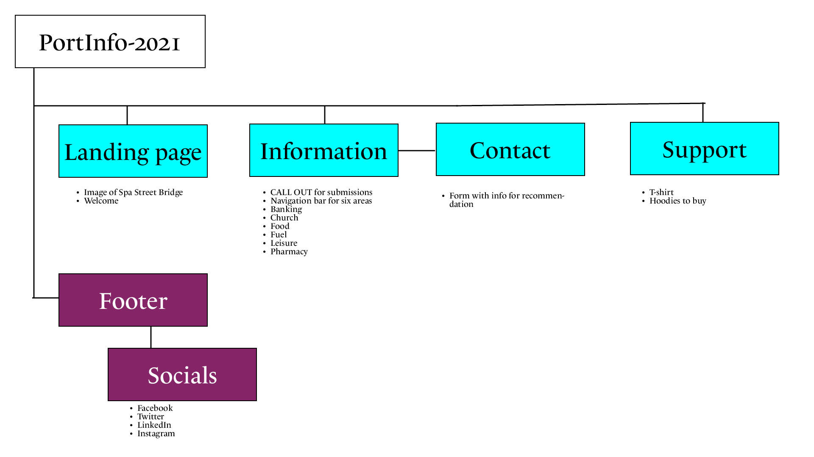
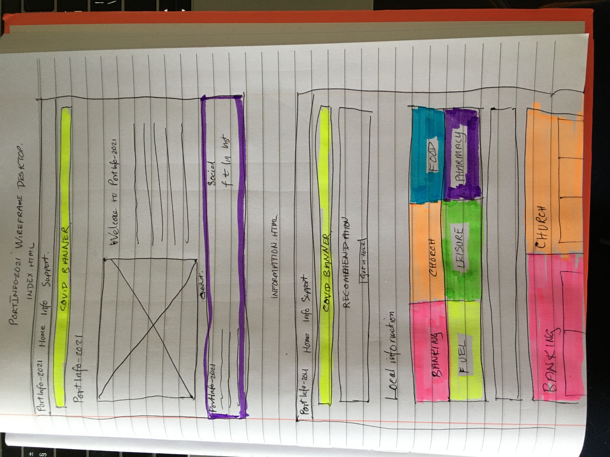
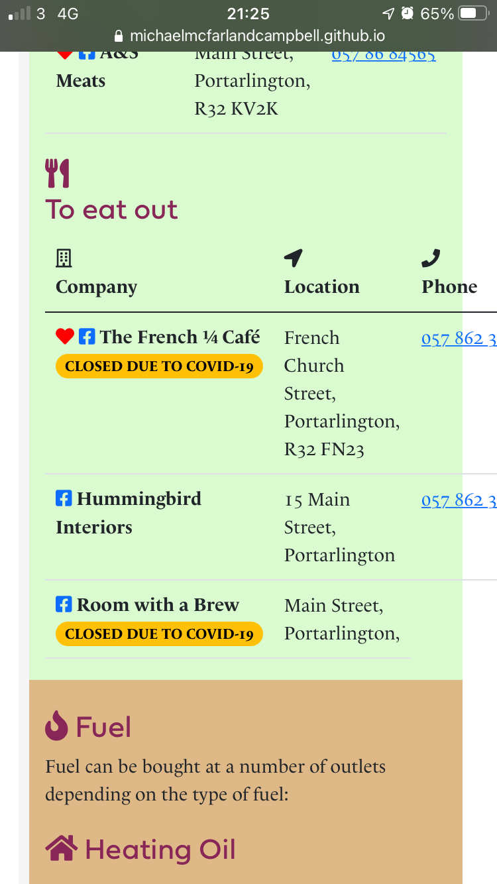
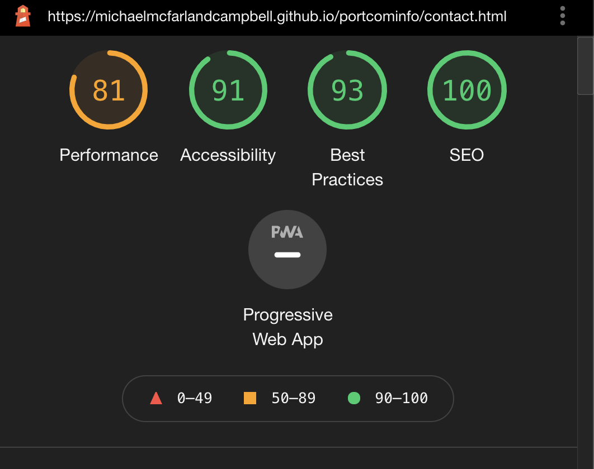

# Portarlington Information 2021 (PortInfo-2021)

[View the live project here.](https://michaelmcfarlandcampbell.github.io/portcominfo/information.html)

## About 
PortInfo-2021 is a fictional community project highlighting the services and shops available in the town of Portarlington in the Irish midlands. 

## User Experience (UX) 
### Strategy

### Ideal user demographic
The ideal user of this website is:
* a resident of Portarlington;
* a visitor to Portarlington; 
* someone moving to the town;
* a business owner in the town. 

### User stories
### Residents' stories
* As a resident, visitor, or someone moving, I want to navigate easily through the website to find relevant information.
* As a resident, visitor, or someone moving, I want to learn more about what shops and organisations there are in the town. 
* As a resident, visitor, or someone moving, I want to easily find links to the organisations highlighted in the page. 
* As a resident, visitor, or someone moving, I want to be able to suppor those who have created the website by buying merchandise. 

### Business owner stories
* As a business owner, I want to navigate through the website easily.
* As a business owner, I want to learn more about what other shops and organisations there are in the town. 
* As a business owner, I want to share contact details for my business and highlight it on the page.
* As a business owner, I want to support the volunteers behind the page. 

### Site owner
* As the site owner, I want to highlight local shops and services to the users.
* As the site owner, I want to make it easy for businesses to ask to be included. 

### Scope
**What a user will expect**

* A website that is easy to navigate.
* Visually appealing regardless of screen size.
* Links and functions work as expected. 
* Information about Portarlington's shops and services.
* A way to contact PortInfo-2021.

**What a user may want** 
* To find links to social media pages.
* To see images of the locations.
* To be able to buy the merchandise online.

**As a developer/ organisation I expect**

* To provide information about the town of Portarlington, its shops, and services.
* To provide an easy way for users to contact me.
* To provide a website that is easy to navigate and with links that work. 

Note Not all of What the user may want will be implemented at this stage. 
Additional features may be implemented in due course. 
### Structure 
The structure of the site is as a tree 

### Skeleton
When creating the website, I used responsive design. When the site is expanded from a mobile, stacked elements will display in two columns in each row, this means that more of the website can be seen at once. 
#### Mobile 

#### Desktop

### Potential features: 
* Showcase photos both historical and modern of the town
* Showcase local shops
* Shop to purchase merchandise  

## Pages
### Home
Information about the page and the Portarlington Community Information Project.

### Local information
This page will have a list of local facilities about:
* Banking
* Church
* Food
* Fuel
* Leisure
* Pharmacy

Above the navigation for these categories will be a box with a button looking for intereaction with the user.  

Some categories will have a recommended entry marked with a red heart using an icon from Fontawesome. 

### Support us
This page will have opportunities to support the local community organisation by highlighting merchandise available from local shops or online.

## Design

### Imagery 
As Portarlington straddles the border between the counties of Laois and of Offaly, which is mainly along the River Barrow at this point, I used a photograph of one of the old bridges in the town that crosses the river. 

As part of the navigation on the [Local Information](https://michaelmcfarlandcampbell.github.io/portcominfo/information.html) page, I used well-known icons from the Fontawesome library. Of particular note is the Rx symbol for Prescription for the Pharmacy. These icons are then also used above the heading in each section of that page to ensure continuity. 

### Colour Scheme
The main colour is 
*  `#872658` which is an approximation for the colour of the Portarlington GAA and Rugby clubs colours. This colour is used for the footer background, and for most headings.

I used Adobe Colour to find complementary colours which are used to highlight each of the sections in the Information page. 

### Typography

#### Headings
Use the [Fieldwork](https://fonts.adobe.com/fonts/fieldwork) font. 

#### Body text and menus 
The [Le Monde Livre Classic](https://fonts.adobe.com/fonts/le-monde-livre-classic) typeface is used for body text and menus. When choosing the font, particular care was taken to ensure that ≪Old Style≫ numbers were available. 

### Continuity 
The page is designed to be user-friendly. The same templates are used on each page with similar headers and footers. This should make it easy and accessible for each user. 

## Technologies used 
### Languages used

 

### Frameworks, libraries, and programs used:
* [Am I responsive](http://ami.responsivedesign.is/)
    - Used to create mockup of the information page for the README.md.
* [Bootstrap4](https://getbootstrap.com) 
    - This framework was used to ensure all pages were responsive across all devices.
* [Font Awesome](https://fontawesome.com) 
    - Using well-known icons to highlight text throughout the site, to enhance the user experience.
* [Git](https://git-scm.com/) 
    - Used via the [Gitpod](https://gitpod.io) platform to create, commit, and push changes in the code to GitHub.
* [GitHub](https://github.com) 
    - Project stored in a repository and to incorporate changes made using Git. Also used for deployment via GitHub Pages. 
* [Tinypng](https://www.tinypng.com) 
    - Used to reduce images in size to aid loading on site. 
* [Typekit](https://fonts.adobe.com/) 
    - Used to source typefaces to complement each other. 

## Testing 
* All HTML code was validated by [W3C Validator](https://validator.w3.org/)

> * [Results of index.html](https://validator.w3.org/nu/?showsource=yes&showoutline=yes&showimagereport=yes&useragent=Validator.nu%2FLV+http%3A%2F%2Fvalidator.w3.org%2Fservices&acceptlanguage=&doc=https%3A%2F%2Fmichaelmcfarlandcampbell.github.io%2Fportcominfo%2Findex.html)
> * [Results of information.html](https://validator.w3.org/nu/?showsource=yes&showoutline=yes&showimagereport=yes&doc=https%3A%2F%2Fmichaelmcfarlandcampbell.github.io%2Fportcominfo%2Finformation.html#textarea)
> * [Results of support.html](https://validator.w3.org/nu/?showsource=yes&showoutline=yes&showimagereport=yes&useragent=Validator.nu%2FLV+http%3A%2F%2Fvalidator.w3.org%2Fservices&acceptlanguage=&doc=https%3A%2F%2Fmichaelmcfarlandcampbell.github.io%2Fportcominfo%2Fsupport.html)
> * [Results of contact.html](https://validator.w3.org/nu/?showsource=yes&showoutline=yes&showimagereport=yes&doc=https%3A%2F%2Fmichaelmcfarlandcampbell.github.io%2Fportcominfo%2Fcontact.html)

* All CSS stylings were validated by [W3C CSS Validator](https://jigsaw.w3.org/css-validator/)

### CSS styling
Although the CSS was validated by the [W3C CSS Validator](https://jigsaw.w3.org/css-validator/), during testing, it was noted by one user that the six areas: #banking #church, #food, #fuel, #leisure, and #pharmacy are all defined separately with a class for each with a `padding-top:20px` style. This could be achieved by creating a new class to join them all together and defining in that class. This would reduce the code required. 

Therefore, I created a new class of `info-area {padding-top: 20px;}` to replace `#banking {padding-top:20px;}`, `#church {padding-top:20px;}`, `#food {padding-top:20px;}`, `#fuel {padding-top:20px;}`, `#leisure {padding-top:20px;}`, and  `#pharmacy {padding-top:20px;}`.

### Links "noreferrer" attribute
It was noted that external links should have `rel="noopener"` as an attribute. So for social media links in the footer and the covid/local info for security purposes. Therefore, I added this in. 

### Call to action/hover in main menu
During user testing, it was noted that the hover was not easy to be seen. So, I changed the navbar to `navbar-dark bg-dark`, and having researched how to change the background for the hover in the navbar, I copied the code from [StackOverflow.com](https://stackoverflow.com/questions/16625972/change-color-of-bootstrap-navbar-on-hover-link), and removed the `.navbar-default` class and the `color` attribute. The background colour was then changed to match the main colour of the site &nbsp;`#872658`.

### Images 

Following feedback from my mentor that the images on the site were far too large to download quickly, especially if users were on a mobile connection, I used the [tinypng.com](https://www.tinypng.com) to reduce their sizes. The three clothing pictures on the Support page were reduced in size by about 80%. 

### Additional feature
Realised that users would not know which of the venues were closed due to the COVID-19 Level 5, so I decided to add a badge to show this. 

Created a badge using `Closed due to COVID-19`.

When testing the site after this change, I realised that the Closed due to COVID-19 badge was too long and so had pushed the phone number into the right-hand margin when on an iPhone 6. 

Therefore, I altered the code to ` Closed COVID-19`. which gave a badge of 

Closed COVID-19. This ensured that the phone numbers remained in the box. 

### Browsers
**Chrome** 

**Edge** 
All pages loaded well in Edge. I checked all the pages in all the formats available in the devtools. The only one where the information page leaked to the right hand side, was for the Galaxy Fold. I used the Lighthouse tool in the development section which produced the following reports: 

_index.html_

_information.html_ 

_support.html_

_contact.html_

## Deployment 
PortInfo-2021 was deployed using GitHub Pages. The following steps were followed: 

1. Log into GitHub and locate the [PortInfo-2021 repository](https://github.com/michaelmcfarlandcampbell/portcominfo).
2.  Press the Settings button at the top of the page. 
3. Scroll down the Settings page until you get to the **Git Hub Pages** section. 
4. Under **Source** click where it says "None" and select "Branch: master".
5. The page will refresh automatically. 
6. Scroll back down to find **GitHub Pages** section, and the link to the site will be displayed. 

## Credits

### Content 
* The content of the page is from my own research of the town. 

### Media
* The photo on the home page is of one of the bridges over the River Barrow, taken by myself. 
* The image on the t-shirt is one using an photo of a forest view near Portarlington, taken by myself, and manipulated using [Adobe Illustrator](https://www.adobe.com/ie/products/illustrator.html), and [PlaceIt.net](https://PlaceIt.net).
* Honeybadger Design logo is my own logo for work I do as a designer.

### Acknowledgements

* I received inspiration for this project from my husband, Andrew, who said that this was the sort of thing we could have done with when we moved from Dublin to Portarlington in 2018.  
* I thank my mentor, Chris Quinn, for all his support and encouragement. He has been brilliant. 
* I particularly thank Daphne Heimgartner, Rebecca Kensall, Phillip Healy, and Aideen Malone for their feedback during user testing. 
* I thank everyone in the Code Institute Slack community as they have been wonderful at supporting me. 